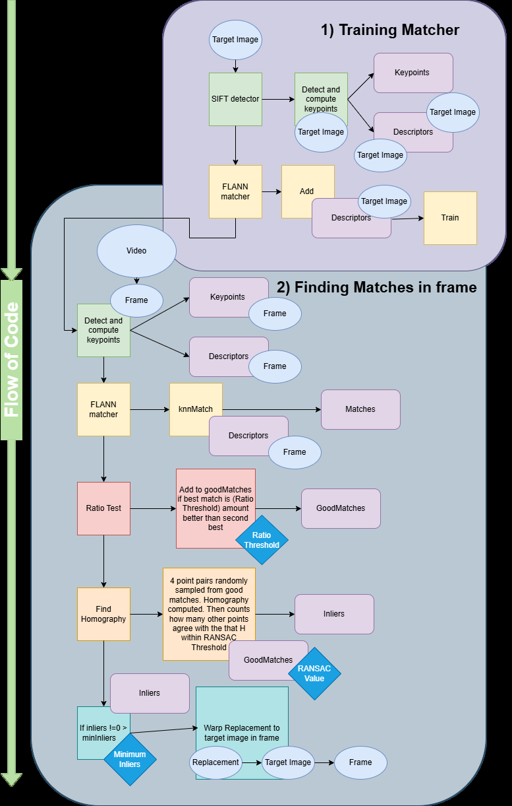
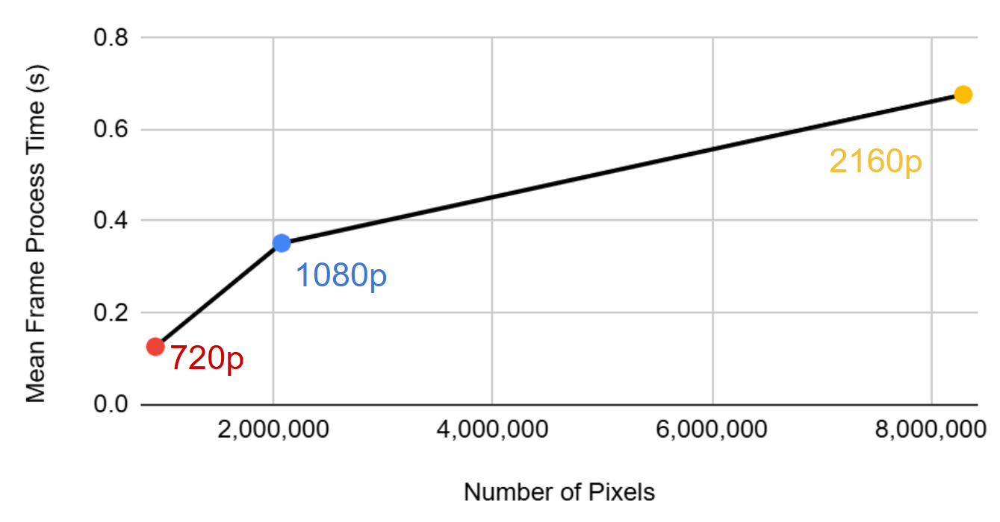
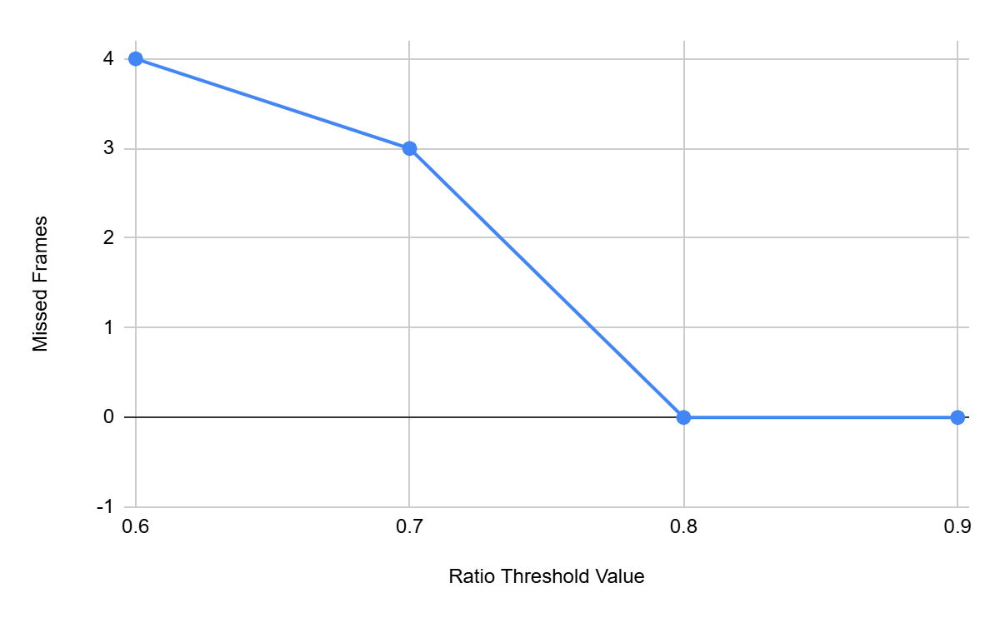
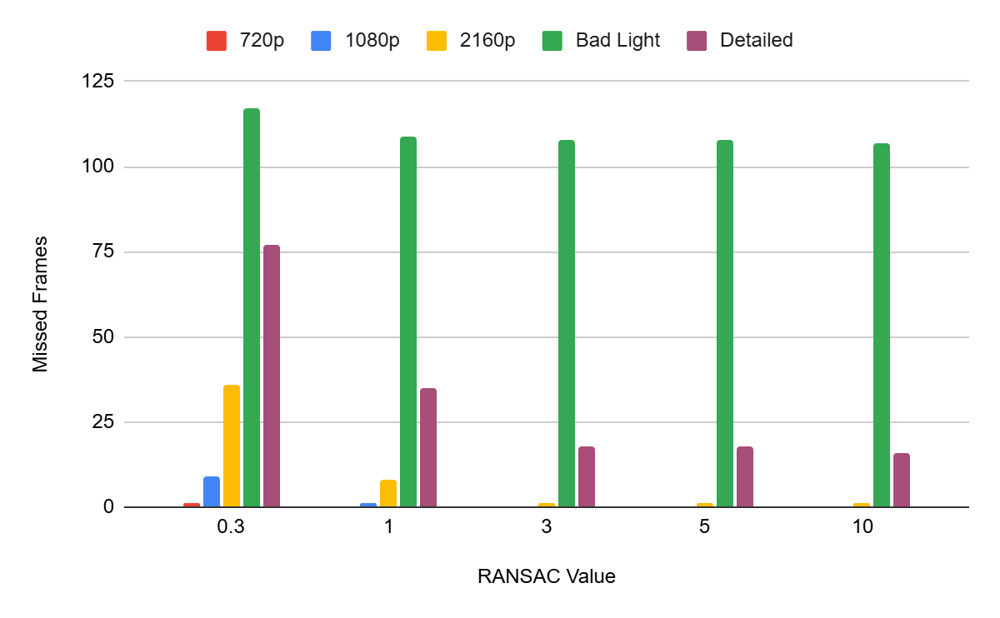
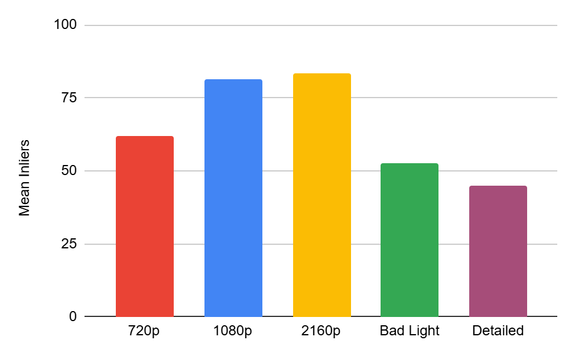

# The Disappearing Book, Feature-Based Object Replacement

A computer vision program that finds a known book cover in a video and replaces it with a different cover, frame by frame, warped to match the book's position and angle. Built for **Visual Computing (COSC346), University of Otago**.

The fun version of this is swapping an object for a lightsaber or a picture of Homer Simpson. The interesting version is the question I actually studied: how do the matching parameters affect the trade-off between how often the replacement appears, how accurate it is, and how long it takes to run?

---

## What It Does

Given a video, a target image (the cover to find), and a replacement image (the cover to paste in), the program processes every frame through a standard feature-matching pipeline:

1. **Detect features** in the target image once, up front, using SIFT, and train a FLANN matcher on them.
2. For each video frame, **detect SIFT features** and match them against the target with FLANN's k-nearest-neighbours (k = 2).
3. **Filter matches** with Lowe's ratio test: keep a match only if the best candidate is clearly better than the second best.
4. **Estimate a homography** between the target and the frame using RANSAC, which finds the geometric transform that the most matches agree on.
5. If enough inliers survive (more than the minimum threshold), **warp the replacement** image through that homography and composite it over the book in the frame.



*The full pipeline. The blue diamonds are the three parameters I varied in the study: ratio threshold, RANSAC threshold, and minimum inliers. My own diagram for the report.*

The program is a command-line tool with the three tunable parameters exposed as optional arguments:

```
objectReplacement <video> <target image> <replacement image> [ratio] [RANSAC threshold] [min inliers]
```

It writes the result to an output video and prints per-frame timing and match statistics as CSV to stdout, which is what feeds the analysis below.

---

## The Parameter Study

The replacement code itself is fairly short. The real work was a controlled experiment into how three parameters shape the result, run across five video conditions: three clean videos at 720p, 1080p, and 2160p, one badly lit video, and one with a busy, detailed background.

For each parameter I wrote down a hypothesis, then ran the program across all the videos to test it.

### Resolution drives processing time (and not linearly)
Higher resolution means more pixels, more features, and more time per frame. The relationship turned out to be noticeably non-linear, which raised an interesting question about how the work scales with data size rather than just resolution.



### Stricter ratio test means fewer but better matches
Lowering the ratio threshold keeps only the most distinctive matches. Too strict and good matches get thrown out, so the overlay starts dropping frames; too loose and weak matches slip through, so the overlay appears more often but flickers and shakes. On the 1080p video, thresholds of 0.8 and above gave zero missed frames, while 0.6 to 0.7 missed more as valid matches were discarded along with the bad ones.



### RANSAC threshold trades precision for coverage
A lower (stricter) RANSAC threshold keeps only matches that fit the geometry tightly, giving a more precise warp but missing more frames. A higher threshold accepts looser matches, so the overlay appears more often but warps less accurately. The detailed scene showed this most dramatically, because its many ambiguous features made RANSAC's job hardest.



### Scene conditions matter as much as parameters
The bad-lighting and detailed-background videos both struggled, but for opposite reasons. Bad lighting gave too few features to match in the first place. The detailed scene gave plenty of matches but most failed at the RANSAC step because they did not fit a consistent geometry, leaving few true inliers.



---

## What I Took From It
- The same pipeline can be tuned toward "always shows something, but jittery" or "rock solid when it appears, but drops frames", and the right choice depends entirely on the use case.
- The ratio test and RANSAC threshold sound similar but filter different failures: the ratio test rejects features that look alike (repeating patterns), while RANSAC rejects features that are geometrically in the wrong place.
- Real-world conditions (lighting, background clutter) can affect the result as much as any parameter, and in ways the parameters alone cannot fully fix.

---

## Repository Contents
- `objectReplacementMain.cpp` is the main program: the full SIFT, FLANN, ratio test, RANSAC, and warping pipeline.
- `Timer.h` / `Timer.cpp` I have NOT included here in this repo but is a small high-resolution timer used to measure per-frame processing time.
- `CMakeLists.txt` builds the project against OpenCV.
- `python/run_experiments.py` automates the study: it runs the compiled program across every video and parameter combination and collects the per-frame CSV output into one results file.
- `images/` holds the figures from the report and the two book covers used as target and replacement.

## Building
Requires OpenCV (with the `features2d` module for SIFT). With OpenCV installed

Then run the executable with a video, a target image, and a replacement image.

## Attribution
The core feature-matching and replacement pipeline, the experiment design, the Python automation, and the analysis are my own work. Some command-line scaffolding and the `Timer` utility followed the structure provided in the course materials.

## Tools
C++, OpenCV (SIFT, FLANN, RANSAC, homography, perspective warping), CMake, Python
